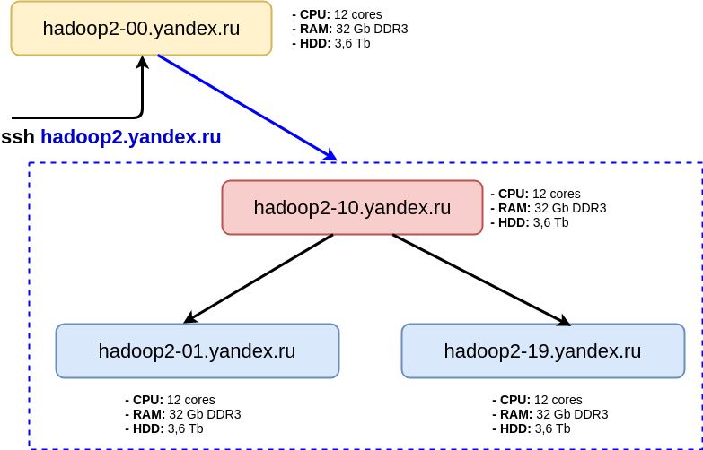

### Структура кластера и роли серверов
Кластер:


    
Клиентская машина: `hadoop2.yandex.ru`

На клиентскую машину заходим по ssh, только с нее есть доступ к кластеру. На сервера кластера по ssh в обычной жизни не ходим, работаем с кластером клиентскими утилитами (hdfs, yarn, hadoop).

Но мы в учебных целях будем ходить на ноды, чтобы посмотреть, как там устроено хранение. Для этого на своего юзера в hadoop2-00 надо закинуть ключ, с помощью которого подключались к кластеру.

Далее можем зайти на любой сервер, например:
```shell script
hadoop2-00:~$ ssh hadoop2-03.yandex.ru
```

### Основные команды

Рассмотрим некоторые команды (для этого необходимо зайти на клиентский сервер):

* Содержимое директорий:
  ```shell script
  hdfs dfs -ls /
  hdfs dfs -ls .
  hdfs dfs -ls 
  ```
  последние 2 команды эквивалентны и относятся к домашней директории; показать, где находится домашняя директория в hdfs `(/user/...)`.

* Создать директорию, загрузить в нее какой-нибудь текстовый файл:
  ```shell script
  hdfs dfs -mkdir <dir>
  hdfs dfs -put <file>
  hdfs dfs -cat <file>
  ```
  В последней команде можно поменять `-cat` на `-text`. 
  
  Создать файл README:
  ```shell script		
  echo "read it" > README
  echo "read it again" >> README
  cat README
  ```
  Загрузить его в HDFS, распечатать оттуда с помощью (`-cat`).

* Переименование и копирование:
  ```shell script
  hdfs dfs -mv <file1> <file2>
  hdfs dfs -cp <file1> <file2>
  ```
  Важно: копирование идет через клиента, для избежания этого или копирования между кластерами есть команда `hadoop distcp`.

* Исследовать директорию `/data`:
  ```shell script
  hdfs dfs -ls /data
  ```
  Вывести на экран часть какого-нибудь файла с помощью `more` (`less`) и `head`. 
  Например, 2 первые строки из файла с Википедией:
  ```shell script
  hdfs dfs -cat /data/wiki/en/articles | head -2
  ```

* Объяснить вывод команды ls, например:
  ```shell script
  $ hdfs dfs -ls /data/wiki/en
  Found 1 items
  -rw-r--r--   3 hdfs supergroup 12328051927 2017-07-03 23:21 /data/wiki/en_articles/articles
  ```
  Выводит пермиссии, число реплик, пользователя, группу, размер, время модификации. 
  
  Посмотреть, что это совпадает со справкой:
  ```shell script
  hdfs dfs -help
  ```

* Сколько места занимают файлы и директории, например:
  ```shell script
  $ hdfs dfs -du -h /data/wiki
  11.5 G  34.4 G   /data/wiki/en_articles
  ```
  Выводит размер и занимаемое место. Последнее учитывает фактор репликации (в данном случае, 3).

* Изменить фактор репликации:
  ```shell script
  hdfs dfs -setrep <path>
  ```
  Посмотреть на эффект с помощью `ls`
  (ставим флаг `-w` если хотим дождаться завершения команды, а не выполнять в фоновом режиме).

* Удалить файл: 
  ```shell script
  hdfs dfs -rm <file>
  ```
  или директорию
  ```shell script
  hdfs dfs -rm -r <file>
  ```

  При удалении файл перемещается в корзину (`~/.Trash`). 
  При этом в корзине воссоздаётся абсолютный путь к файлу (`.../.Trash/user/your_user/your_dir/your_file`). 
  Для удаления в обход корзины используйте флаг `--skipTrash`.

Остальные команды: `-help`.

### Обёртка над HDFS shell

Стандартный HDFS shell:
* Не хранит состояние.
* На каждую команду стартует своя Java Virtual Machine.
* Нет автодополнения.
* Нельзя сменить пользователя (`su ...`).
 
В 2017 г. в Avast разработали обрёртку над HDFS shell: https://github.com/avast/hdfs-shell.
Написана на Java, но с точки зрения пользователя - bash.
 
Простая установка:
* Скачиваем бинарник (например, при помощи `wget`).
* Разрахивируем (`unzip`) и добавляем `./libs` в `CLASSPATH`.
* Заходим в `hdfs-shell-1.0.7/bin`.
* Запускаем `hdfs-shell.sh`.

На кластере оболочка установлена, просто запустите `hdfs-shell`.
 
Pros:
* Сокращённые названия команд (например, `ls`, а не `hdfs dfs -ls`), подробнее - выполните `help`.
* Есть автоподстановка.
* Есть дополнительные команды, которые есть в bash, но нет в HDFS shell (например, `pwd` или `groups`).
* Можно создавать свои команды и встраивать их в обёртку.

Cons:
* Нельзя выполнять цепочки команд (например, `ls -l | grep`).
* Через `su` можно сменить пользователя без авторизации => небезопасно. 

### Обёртки над HDFS Shell
* PyDoop, Hadoopy, MRJob
* [hdfscli](https://hdfscli.readthedocs.io/en/latest/)

Для того, чтоб HDFS CLI заработал на кластере, нужно прописать такой конфиг:
```
[global]
default.alias = default

[default.alias]
url = http://hadoop2-10.yandex.ru:50070
```
в файле `~/.hdfscli.cfg`.

### Веб-интерфейс Namenode

Пробрасываем порт `50070`:
  ```shell script
  ssh -L 50070:hadoop2-10.yandex.ru:50070 my_user@hadoop2.yandex.ru
  ```
  или
  ```shell script
  ssh my_user@hadoop2.yandex.ru -L 50070:hadoop2-10:50070 
  ```
Пока сессия ssh открыта, интерфейс будет доступен тут: http://localhost:50070.

Показать:
* Heap memory used/total - сколько памяти на NN и насколько занята (если сильно занята - проблемы),
* Capacity - сколько всего места в DFS,
* DFS Used - сколько занято,
* Live nodes - сколько живых датанод и насколько заполнены,
* Utilities -> Browse the Filesystem.

### Структура хранения в HDFS
#### HDFS fsck

Посмотреть, на какие блоки разбит файл, какого они размера, их идентификаторы, где они расположены:
```shell script
hdfs fsck /data/wiki/en/articles -files -blocks -locations
```

Посмотреть информацию по одному блоку, например:
```shell script
hdfs fsck -blockId blk_1073971176
```

#### WebHDFS REST API

Открыть файл на чтение, получив редирект на нужную датаноду. Выполняет команду на сервере:
```shell script
curl -i "http://hadoop2-10.yandex.ru:50070/webhdfs/v1/data/wiki/en/articles?op=OPEN"
```

Из результата предыдущей команды взять `Location`, добавить `&length=100` - получить 100 первых символов файла.

Подробнее: http://hadoop.apache.org/docs/r1.2.1/webhdfs.html.

### Оценка характеристик кластера

**Задача 1:** 
Для HDFS с суммарной ёмкостью дисков 2PB c размером блока 64MB и фактором репликации 3 оценить минимальный объем RAM на Namenode. Считаем, что каждый блок (независимо от числа реплик) занимает в памяти 600B.

**Решение:** 
2PB / 64MB - число блоков. 

Разных блоков будет: 2PB / 64MB / 3

Требуемая память:
(2PB / 64MB / 3) * 600B = 6.25GB

**Задача 2:**
На кластере используются HDD с характеристиками: seek time - 12мс, скорость линейного чтения - 210 MB/c. Какой минимальный размер блока в HDFS стоит выбрать, чтобы время поиска блока составляло не больше 0.5% от времени чтения блока?

**Решение:**
0.5% от времени чтения блока размера Х должен быть не меньше 12мс:

X / 210 MB/c * 0.005 >= 0.012 c

X >= 0.012 * 210 / 0.005 = 504 MB 

* [Дополнительная информация по HDFS](http://www.blogjava.net/DLevin/archive/2015/01/25/422428.html) - сохранённая копия страницы блога Hortonworks.
