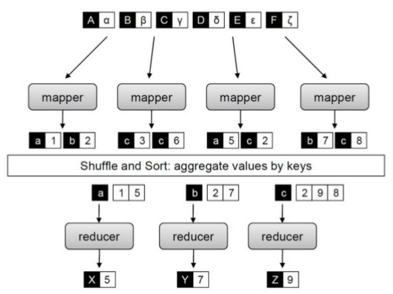

Заходим на `my_login@hadoop2.yandex.ru`

### Парадигма MapReduce



#### 1. Задача на подсчёт кол-ва встречаемости слов в тексте (WordCount)

Логика решения задачи
1. **Read**. Считывает данные из входного пути, разбивает на сплиты (обычно размер сплита = размер HDFS-блока), распределяет сплиты по мапперам.
2. **Mapper**. Получает на вход данные построчно и разбивает по словам. На выходе пары `(слово, 1)`.
3. **Shuffle & sort**. Сортирует данные по ключу (слово) и передаёт их в таком виде, чтоб все строки с одинаковыми ключами гарантированно пошли на 1 reducer.
3. **Reducer**. Суммирует кол-ва слов с одинаковыми ключами. Ключи приходят упорядоченно, т.е. не может прийти k2 пока не закончились пары с k1. На выходе пары `(слово, кол-во)`.

```bash
OUT_DIR="streaming_wc_result"
NUM_REDUCERS=8

hadoop fs -rm -r -skipTrash $OUT_DIR*  # удаляем результаты предыдущего запуска (HDFS не перезаписывает данные поэтому без удаления выдаст ошибку о том, что путь занят).

yarn jar /opt/cloudera/parcels/CDH/lib/hadoop-mapreduce/hadoop-streaming.jar \  # подключаем jar-файл с инструментами Hadoop Streaming
    -D mapreduce.job.reduces=${NUM_REDUCERS} \  # устанавливаем кол-во reducer'ов в задаче
    -files mapper.py,reducer.py \  # добавляем файлы в distributed cache чтоб каждая нода имела к ним доступ
    -mapper mapper.py \  # для такой записи файлы должны быть исполняемыми
    -reducer reducer.py \  # в противном случае пишем `python mapper.py`, `bash mapper.py` в зависимости о того, на чём написан код.
    -input /data/wiki/en_articles_part \  # входны и выходные данные
    -output $OUT_DIR # относительный путь (= /user/my_user/${OUT_DIR})

# Проверка результата.
# Каждый reducer генерирует вывод в свой файл. Файлы имеют вид `part-XXXXX`.
for num in `seq 0 $(($NUM_REDUCERS - 1))`
do
    hdfs dfs -cat ${OUT_DIR}/part-0000${num} | head  # Выводим 1-е 10 строк из каждого файла. 
done
```
Исходники: `/home/velkerr/msbdp2019/01-wordcount`.

Смотрим на ApplicationMaster. http://hadoop2-10.yandex.ru:8088/cluster (если зашли без прокси - перезайдите ещё раз). Можно отслеживать статус выполнения задачи.
Команда с пробросом портов:

```bash
ssh <USER>@hadoop2.yandex.ru -L 8088:hadoop2-10:8088 -L 19888:hadoop2-10:19888
```

Чтоб отличать свою задачу от других, удобно присвоить ей имя. Для этого в Streaming driver дописываем: `-D mapred.job.name="my_wordcout_example"`.

**Отключим Reduce-стадию у задачи и запустим её. Что видим?**

### Структура MapReduce-task (Map, Reduce)

```
public void run(Context context) {
    setup();
    while (keys.next()) {
        reduce(key, value);
    cleanup();
```

Посмотрим на пример WordCount:
```
current_key = None
sum_count = 0
for line in sys.stdin:
    try:
        key, count = line.strip().split('\t', 1)
        count = int(count)
    except ValueError as e:
        continue
    if current_key != key:
        if current_key:
            print "%s\t%d" % (current_key, sum_count)
        sum_count = 0
        current_key = key
    sum_count += count
if current_key:
    print "%s\t%d" % (current_key, sum_count)
```

Где здесь стадии setup(), cleanup(), run()?

#### 2. Отладка MapReduce-задач

**Эмуляция работы Hadoop с помощью bash-скрипта.**

1. Скачиваем часть данных себе локально из HDFS (они уже скачаны `/home/velkerr/msbdp2019/01-wordcount/in`).
2. Запускаем `cat articles-sample | ./mapper.py | sort | ./reducer.py`.

Исходник: `/home/velkerr/msbdp2019/01-wordcount/test_local.sh`

**Запуск Hadoop в локальном режиме** 

1. Запуск такой же, как и в распределённом, но нужно прописать после "yarn" специальный конфиг: `--config /opt/cloudera/parcels/CDH/etc/hadoop/conf.empty`
2. При этом программа будет читать и писать уже не в HDFS, а в локальную файловую систему.

При локальном запуске reducer будет всегда 1 (вне зависимости от кол-ва в streaming-драйвере).

Исходник: `/home/velkerr/msbdp2019/01-wordcount/run_local.sh`

### Счётчики в MapReduce
 - ещё 1 возможность отладки
 - возможность в некоторых случаях избежать редьюсера.
 
Исходник: `/home/velkerr/msbdp2019/06-counters`

#### 3. Задача
В выводе примера можно было увидеть много мусора, который словами не являлся. Теперь ваша задача:
- избавиться от пунктуации при подсчёте слов.
- не учитывать регистр при подсчёте.

#### 4. Combiner
Бывает так, что на выходе мапперов имеются данные, пригодные для аггрегации. Если мы их саггрегируем **до** reduce-стадии, это сэконмит ресурсы reducer'ов. Для этого существет **combiner**. Его формальная модель такая же, как и у reducer'a: `(k, v1), (k, v2) -> (k, [v1, v2])`, но реализация имеет 2 отличия:
* combiner вызывается на выходе одного маппера,
* система не даёт гарантий, сколько раз выполнится combiner и выполнится вообще.

*Нужен ли combiner в нашем примере? Каким он может быть?

#### 5. Объединение нескольких задач
В реальной жизни Hadoop-программы состоят из большого кол-ва задач, которые выполняются в разной последовательности и образуют направленный граф вычислений (DAG). Побробуем отсортировать слова по частоте встречаемости. 

Исходник: `/home/velkerr/msbdp2019/03-chaining/run.sh`

#### 6. Задача. Стоп-слова
Отфильтровать стоп-слова при подсчёте слов. Стоп-слова находятся в `/datasets/stop_words_en.txt`. Для работы с файлом в рамках задачи, его нужно добавить в DistributedCache.
Обратите внимание, что файлы с кодом (mapper.py, reducer.py, combiner.py) тоже добавляются в DistributedCache. В DistributedCache нельзя положить большой файл (во-первых неоптимально, во-вторых DistributedCache имеет ограничнения по размеру)

Изменение кодировки для wiki в python 3:

```python
import io
input_stream = io.TextIOWrapper(sys.stdin.buffer, encoding='utf-8')
```

#### 7. Задача. Подсчёт числа PI.
Оценить значение числа PI методом Монте Карло. 

[Статья на Хабре](https://habr.com/ru/post/128454/)

Исходник: `/home/velkerr/msbdp2019/07_pi_stub`

### Joins
Определите число пользователей stackoverflow, которые задавали вопросы с FavoriteCount >= 100 и давали при этом правильные ответы, т.е. с наибольшим Score для вопроса. Для подсчета результирующего числа пользователей можно использовать счетчики (Hadoop counters).
Входные данные: посты stackoverflow.com
Формат вывода: идентификаторы пользователей, по одному на строку
На печать: число пользователей
