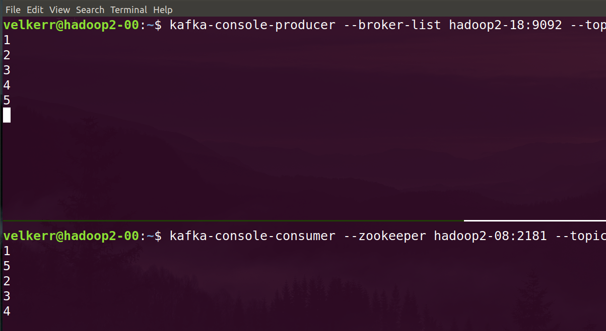

## Apache Kafka
Apache Kafka - это распределённый диспетчер, работающий на основе Zookeeper.

### Архитектура


### Терминология и особенности
* Единица представления в Kafka - логи
    * _чем отличаются логи от обычных тестовых строк, какая ключевая особенность их хранения?_
* Семантика доставки сообщений (из коробки) - At most once если репликация асинхронная и At least once если синхронная.
    * _Какие вы знаете семантики доставки сообщений? Для каких задач предпочительна каждая из них?_
* Асинхронная репликация
* Не хранит порядок сообщений (в отличие от обычных очередей)

Типы репликаций:
1. __Синхронная.__ Вновь пришедшие данные реплицируются синхронно на несколько нод.
    * Пример: Hadoop
2. __Асинхронная.__ Вновь пришедшие данные считаются записанными в систему тогда когда они записаны хотя бы на 1 ноду (она называется в этом случае **лидером**). Репликация на остальные ноды происходит уже после этого. Для каждой партиции лидером могут являться *различные ноды*.
    * Пример: Kafka

Асинхронная репликация работает быстрее, но при этом больше вероятность потери данных.

Отличия лидера в Kafka от мастера (NameNode) в Hadoop.
* Мастер контролирует выполнение задач рабочими узлами, но не делает за них вычисления.
* Лидер же имеет функционал рабочего узла, но при этом обладает специфич. свойствами (например, хранит самую свежую версию данных).
* В Kafka чтение сообщения происходит из лидера, остальные ноды нужны для бекапа.

### Kafka CLI

Сервисы, которые использует Kafka:

| **Service** | **URL** |
|:-------:|:---:|
|Zookeeper servers|hadoop2-08:2181|
||hadoop2-09:2181|
||hadoop2-10:2181|
|Kafka brokers|hadoop2-15:9092|
||hadoop2-16:9092|
||hadoop2-17:9092|
||hadoop2-18:9092|
||hadoop2-19:9092|
|Kafka bootstrap-servers| те же адреса, что и у брокеров|

#### Работа с топиками
Для того, чтоб работать с топиками нужно подключиться к Kafka. Для этого в параметры нужно передать хотя бы одну ноду Zookeeper. Команда обращается к Kafka, получает все сервера Zookeeper и с их помощью ищет нужный топик.

##### Выведем список топиков
```
kafka-topics --zookeeper hadoop2-08:2181 --list
```
##### Создадим топик
Для топика нужно определить:
* число партиций,
* фактор репликации,
* название топика.
```
kafka-topics --zookeeper hadoop2-08:2181 --create \
    --partitions 6 \
    --replication-factor 2 \
    --topic ${USER}-topic
```

(вместо `XX` напишите 2 последние цифры своего аккаунта)
Снова делаем `list` и проверим, что топик создался. 

Попробуем создать ещё 1 топик с коэффициентом репликации 12. Получаем:
```
Exception: replication factor: 12 larger than available brokers: 4
```
В Kafka коэффициент репликации ограничен кол-вом брокеров (в отличие от Hadoop, где он ограничен только здравым смыслом :) ). 

Для удаления топика используется аргумент `--delete`.
```
kafka-topics --zookeeper hadoop2-08:2181 --delete --topic ${USER}-topic
```

##### Вывод информации о топике
Для этого вызываем `--describe`
```
kafka-topics --zookeeper hadoop2-08:2181 --describe --topic ${USER}-topic
```
Что мы видим:
```
Topic:velkerr-topic	PartitionCount:6	ReplicationFactor:2	Configs:
	Topic: velkerr-topic	Partition: 0	Leader: 556	Replicas: 556,557	Isr: 556,557
	Topic: velkerr-topic	Partition: 1	Leader: 557	Replicas: 557,558	Isr: 557,558
	Topic: velkerr-topic	Partition: 2	Leader: 558	Replicas: 558,565	Isr: 558,565
	Topic: velkerr-topic	Partition: 3	Leader: 565	Replicas: 565,556	Isr: 565,556
	Topic: velkerr-topic	Partition: 4	Leader: 556	Replicas: 556,558	Isr: 556,558
	Topic: velkerr-topic	Partition: 5	Leader: 557	Replicas: 557,565	Isr: 557,565
```
* 6 партиций,
* 2 реплики у каждой,
* лидер и ISR для каждой партиции (например, видим, что 0-я и 4-я партиции имеют лидеров на 1 машине, а рабочие ноды у них отличаются)

Лидеры назначаются с помощью [Round-robin](https://ru.wikipedia.org/wiki/Round-robin_(%D0%B0%D0%BB%D0%B3%D0%BE%D1%80%D0%B8%D1%82%D0%BC)). При этом, Kafka умеет балансировать нагрузку в зависимости от загруженности нод.

#### Чтение-запись в топик

* consumer читает данные, использует zookeeper
* producer записывает данные, использует kafka-broker

Kafka может читать данные из разных источников (HDFS, выходы приложений, базы данных, ханилище Amazon AWS). Можем также смешивать источники. Мы рассмотрим самый простой источник - консоль.

##### Прочитаем данные из топика данные в топик
```
kafka-console-consumer --zookeeper hadoop2-08:2181 --topic ${USER}-topic
```
Команда сама не завершится т.к. она читает данные в реальном времени (ждёт, пока что-нибудь запишется в топик). Данных нет, прерываем команду.

##### Запишем данные в топик
Для этого нужно указать не Zookeeper-server, а список Kafka-брокеров. В списке достаточно 1 элемента.
```
kafka-console-producer --broker-list hadoop2-16:9092 --topic ${USER}-topic
```
Запишем последовательно несколько чисел в топик и завершим команду.

Можно записывать всю последовательность одной командой: `seq 20 | kafka-console-producer --broker-list hadoop2-16:9092 --topic ${USER}-topic`

##### Realtime чтение-запись.
Запускаем `tmux` и создаём 2 панели. В одной из них запускаем consumer, в другой - producer.



Записываем числа и видим, что они синхронно отображаются в consumer'e, но перемешиваются.

Можно писать в один топик из нескольких источников и таким образом получится примитивный аналог TCP-чата.

Завершаем команды.

##### Kafka не хранит время поступления данных
Попробуем ещё раз прочитать данные... и видим, что снова ничего нет :(

По умолчанию consumer выводит только вновь поступившие сообщения, те, которые имеют самый свежий отступ (вспоминаем Offset'ы в Hadoop). Попробуем вывести весь топик.
```
kafka-console-consumer --zookeeper hadoop2-08:2181 --topic ${USER}-topic --from-beginning
```
Данные выводятся, но в перемешанном виде (см. начало семинара, Kafka не хранит порядок сообщений в топике).

В более новой версии мы можем вывести данные из конкретной партиции. Для использования этой фичи нужно использовать new-style consumers. В первом приближении они отличаются от обычных консьюмеров тем, что у работают не брокерами, а с bootstrap-серверами. Это более общий интерфейс kafka, который знает и о брокерах, и о ZooKeeper'ах.
```
kafka-console-consumer --bootstrap-server hadoop2-17:9092 --topic ${USER}-topic --new-consumer --from-beginning --partition 0
```
В рамках одной партиции видим упорядоченный результат.

##### User-defined скрипты для Kafka.
* [Java Doc по Kafka API](https://kafka.apache.org/10/javadoc/?org/apache/kafka/),
* [Python API](https://kafka-python.readthedocs.io/en/master/usage.html) тоже есть.

```
kafka-run-class kafka.tools.GetOffsetShell --broker-list  hadoop2-17:9092 --topic ${USER}-topic --time -1
```

### Связка Spark Streaming и Kafka

Цель задачи - посчитать Wordcount текста, передаваемого в топик.

##### Пишем обработчик

Создаём контексты
```python
from pyspark import SparkContext
from pyspark.streaming import StreamingContext
from pyspark.streaming.kafka import KafkaUtils

sc = SparkContext(master='yarn')
ssc = StreamingContext(sc, batchDuration=10)
````

Подключаемся к топику и создаём DStream (см. предыдущий семинар):
```python
dstream = KafkaUtils.createDirectStream(
    ssc, topics=['test'],
    kafkaParams = {'metadata.broker.list': 'hadoop2-17:9092,hadoop2-18:9092'} # указаываем > 1 брокера для отказоустойчивости.
)
```
Лучше указывать несколько брокеров на случай если 1 упадёт.

Логика WordCount:
```python
result = dstream \
        .flatMap(lambda (x, line): line.split(" ")) \
        .map(lambda word: (word, 1)) \
        .reduceByKey(lambda x, y: x + y)
result.pprint()
```

Запускаем обработку и ждём SIGINT (Ctrl^C).

```
ssc.start()
ssc.awaitTermination()
```

##### Тестируем

1. Открываем топик ${USER}-topic на запись.
2. В другой tmux-вкладке (или другом терминале) запускаем наше Spark-приложение.
3. Пишем текст в топик и смотрим, что выводит приложение.

```
-------------------------------------------
Time: 2019-04-10 21:43:50
-------------------------------------------
(u'', 1)
(u'rh', 1)
(u'etrthrhtt', 1)
```

#### Добавляем Stateful-подход в нашу программу

Для этого понадобится:
* В `updateStateByKey()` написать логику обновления состояния.
* В `foreachRDD()` прописать логику вывода результата.
* Не забываем также про `ssc.checkpoint()`, он нужен для сохранения состояния, кот. обновляется в `updateStateByKey()`.

Подробнее см. [предыдущий семинар](05-realtime.md).

#### Учим приложение останавливаться автоматически когда данные закончились

1) До начала обработки проверяем, приходят ли ещё данные.

```python
finished = False

def set_ending_flag(rdd):
    global finished
    if rdd.isEmpty():
        finished = True

dstream.foreachRDD(set_ending_flag)
```

2) Вместо `ssc.awaitTermination()` останавливаем контекст только когда данные закончились.

```python
ssc.start()
while not finished:
    time.sleep(0.1) # вспоминаем почему плохо использовать pass
ssc.stop()
```

#### Исходники

`/home/velkerr/msbdp2019/17-kafka`
