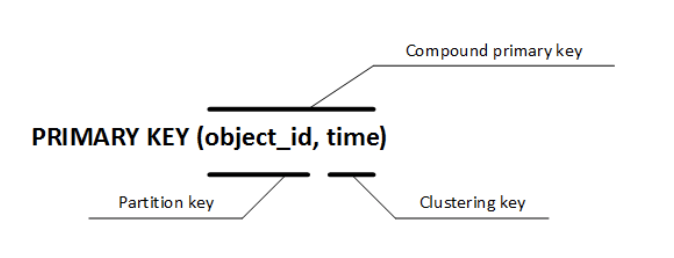
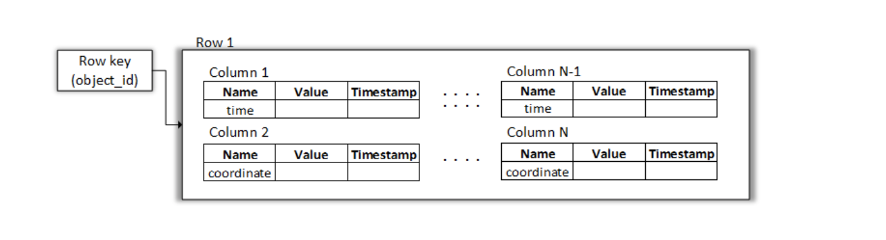

# Теоретическая часть
### Whitepapers
- [Dynamo: Amazon’s Highly Available Key-value Store](https://www.allthingsdistributed.com/files/amazon-dynamo-sosp2007.pdf)
- [Cassandra - A Decentralized Structured Storage System](https://www.cs.cornell.edu/projects/ladis2009/papers/lakshman-ladis2009.pdf)
- [Презентация И. Пузыревского (Яндекс, 2015 г.) про Cassandra](https://drive.google.com/file/d/0B2n4K2J_6IZdSFlLNlhKSEZtMmM/view?usp=sharing)


## Дизайн

_В какой компании была разработана система Dynamo? Зачем ей понадобилась подобная система?_

Amazon

_Назовите ключевые требования, которые определили дизайн Dynamo/Cassandra_. 

1. Инкрементальня масштабируемость: система должна легко принимать новые узлы.

По этой причине система децентрализованная: у peer-to-peer систем, в отличие от централизованных, нет потенциально узкого места в виде мастера/ансамбля мастеров.
 
2. Система всегда должна быть доступна для записи.

Принимая такое требование, мы неизбежно отказываемся от согласованности в силу CAP.

_Что такое NoSQL базы данных?_

https://ru.wikipedia.org/wiki/NoSQL

_В чем разница между Dynamo и Cassandra?_

Dynamo на момент создания была чистым key/value хранилищем. В отличие от нее, Cassandra эмулирует поверх key/value архитектуры табличную модель данных со схемами и ограниченным декларативным языком запросов.

- https://www.ebayinc.com/stories/blogs/tech/cassandra-data-modeling-best-practices-part-1/
- https://stackoverflow.com/a/19140553

## Партиционирование

_Как система выбирает, какой узел будет хранить тот или иной ключ?_

С помощью consistent hashing

_Что такое виртуальный узел?_

Один узел может выбрать себе несколько токенов и получить несколько позиций на кольце хешей. С точки зрения consistent hashing разные точки - это разные узлы, но они будут отображаться на один физический.

_Зачем нужны виртуальные узлы?_

Во-первых, можно улучшить сбалансированность разбиения в случае, когда физических узлов очень мало. Во-вторых, мы можем добавлять в систему узлы разной емкости: тот узел, у которого больше дисков, может выбрать себе больше токенов и хранить больше сегментов кольца.

## Gossiping

_Что такое gossiping?_

Это механизм распространения информации в peer-to-peer системах. Каждый узел системы с фиксированной периодичностью случайным образом выбирает одного из известных ему участников системы и обменивается с ним информацией.

_Как Dynamo использует Gossip-протокол?_

Чтобы обмениваться информацией о живых узлах и о позициях узлов на кольце. С помощью gossip-протокола участники договариваются о единой таблице маршрутизации для consistent hashing.

_Как новый участник может начать распускать слухи, если он никого не знает?_

Для этого в конфиге узла статически заданы узлы-хабы - seed nodes - через которых участник узнает обо всех остальных (а остальные - про него)

_Узлы обмениваются полной информацией о составе кластера?_

Нет, они стараются отправлять небольшие дельты: http://www.cs.cornell.edu/home/rvr/papers/flowgossip.pdf

## Репликация

_Какие узлы назначаются репликами ключа?_

Узлы, идущие на кольце за хэшом ключа по часовой стрелке

_Почему выбирать реплики для ключа как rf подряд идущих узлов - не самая лучшая затея?_

Во-первых, потому что мы можем встретить виртуальные узлы одного и того же физического узла, тогда эффективный rf снижается. Во-вторых, среди подряд идущих узлов могут быть узлы из одной серверной стойки. А значит при выходе из строя сетевого коммутатора этой стойки мы потеряем сразу несколько реплик одного ключа, чего мы не хотим.

## Кворумы

_В чем смысл кворумных чтений/записей?_

Система может подтвердить запись или прочитать значение в ситуации, когда не все реплики данного ключа доступны (например, из-за партишена сети или произвольного ребута).

_Какое ограничение мы накладываем на кворумы?_

Кворумы на запись и на чтение должны пересекаться. Мы хотим гарантировать, что чтение, которое началось после завершения записи, увидит результат этой записи.

_Приведите пример нарушения атомарности при использовании кворумных оперций_


Не так давно в Cassandra появился линеаризуемый CAS, который использует алгоритм Paxos:
https://docs.datastax.com/en/cql/3.3/cql/cql_using/useInsertLWT.html

_Что такое sloppy quorums?_

Способ сохранить доступность на запись в условиях партишена. Из-за партишена в сети/сбоя узлов может получиться так, что координатор записи не может собрать необходимый кворум из реплик ключа. В этом случае координатор может сделать запись на узлы, которые не являются репликами, но потребовать от них, чтобы они протолкнули запись на реплики, когда те снова будут доступны - механизм hinted handoff.
При таком подходе рассчитывать на то, что чтение прочитает последнюю запись, не приходится.

## Конфликты

_Как в системе могут возникнуть разные варианты значений для одного и того же ключа?_

Разные операции записи могли приземлиться на разных координаторов, которые могли использовать разные кворумы на запись. Более долгоиграющая причина: в сети мог возникнуть партишен, и клиенты, которые оказались в разных частях партишена, сделали записи на разные sloppy кворумы.

_Какие подходы к версионированию и обнаружению / разрешению конфликтов используют Cassandra и Dynamo?_

Last Write Wins и Vector Clocks

_Как устроен LWW?_

Координатор записи или клиент присваивают значению временную метку с помощью локальных часов. В системе остается та запись, которая получила большую временную метку.

_Кто занимается разрешением конфликтов в случае LWW?_

Сама система. Например, с помощью механизма read repair: если координатор чтения увидел, что на разных репликах лежат разные версии ключа, то он выберет значение с большим таймстемпом и проталкивает его на отстающие реплики.

_Чем плох подход LWW?_

Он работает в предположении о синхронности часов, которое конечно же может нарушаться в реальной системе. Никакой протокол синхронизации часов не может гарантировать идеальной синхронизации даже в предположении, что часы не дрейфуют.

См. также примеры про реализацию set-а: https://aphyr.com/posts/294-call-me-maybe-cassandra/

_Когда достаточно LWW?_

Когда апдейты очень редкие и никакой конкуренции нет. Например, мы храним хэши паролей.

_Какая альтернатива у LWW?_

Векторные часы, которые учитывают причинность между записями ключа.
Тут нужно более подробно рассказать про векторные часы и про их связь с happens-before.

_Кто занимается разрешением конфликтов в этом подходе?_

Клиент системы. Если в системе есть конфликтующие версии, т.е. такие, что ни одна не предшествует другой в смысле happens-before, то чтение возвращает клиенту все эти конфликтующие версии.

_Как Dynamo борется с ростом числа компонент в векторных часах?_

Dynamo старается сделать координатором операции для ключа первый узел из числа реплик, если он не доступен, то второй и т.д. При использовании LWW координатором может стать произвольный узел системы.

## Хранение

_Как Cassandra хранит данные в пределах одного узла?_

С помощью LSM-деревьев: https://wiki.apache.org/cassandra/MemtableSSTable

# Практическая часть

## Особенности Apache Cassandra.
* CQL — это SQL-подобный язык. Аббревиатура от Cassandra Query Language.
* Основная единица хранения — строка. Строка целиком хранится на нодах, т.е. нет ситуаций когда полстроки — 
на одной ноде, полстроки — на другой. Строка может динамически раширяться до 2 миллиардов колонок.
* Строка может храниться на нескольких узлах - репликация.  Если у вас фактор репликации N и вы погасили N-1 машин, данные будут и дальше доступны.
* Помимо обычных значений, вроде целых чисел, строк и дат, в столбцах могут храниться коллекции, например, map<T1, T2>, list<T> и set<T>
* При каждом чтении и записи клиент может указать желаемый уровень консистентности — ANY, ONE, TWO, THREE, QUORUM, SERIAL, ALL и другие. 
* Например, уровень ONE (используется по умолчанию) говорит, что запрос должен дойти хотя бы до одного узла, отвечающего за хранение строки, 
 а уровень QUORUM — что запрос должно получить большинство узлов, например, 2 из 3. Таким образом, можно всегда выбирать между скоростью выполнения запросов и надежностью. 
 По умолчанию в фоне ноды Cassandra работает read repair процесс, приводящий все ноды в консистентное состояние, поэтому для многих задач ONE является 
 вполне подходящим уровнем
* Помимо clustering key есть еще и вторичные индексы.

## Подключение к кластеру 
ssh USER@mipt-client.atp-fivt.org

## Начало работы с Cassandra
Войти в cql можно командой: `cqlsh <node>`. Не пишите в качестве ноды loclhost или mipt-client. Пишите любую из node кроме 9й.

Выйти из него - exit.

 KeySpace - пространство имен, которое определяет репликацию данных на узлы. Изначально кластер содержит отдельное 
 пространство имен для каждого узла
 Можно создать свое пространство ключей:
 
```code
CREATE KEYSPACE “KeySpace Name”
WITH replication = {'class': ‘Strategy name’, 'replication_factor' : ‘No.Of  replicas’}

AND durable_writes = ‘Boolean value’;

```
Команда создания пространства имен содержит два параметра: replication_factor, durable_writes, которые преставляют
стратегию репликации и свойство, что при записе происходит ожидание, пока запись произойдет на все реплики.
Стратегии репликации:
* Simple Strategy. Рекомендуется использовать при одном дата центре. Первая реплика помещается на узел в соответствии с распределением,
остальные - на узлы в порядке часовой стрелки. 
* Network Topology Strategy. В кластере более одного дата центра. Необходимо представить фактор репликации для каждого дата центра отдельно.

Replication Factor - число реплик записи на различных узлах. 

Пример:

```
~:$ cqlsh mipt-node03
CREATE KEYSPACE University WITH replication = {'class': 'SimpleStrategy', 'replication_factor': 3};
```
или

```
cqlsh mipt-node03 -e "CREATE KEYSPACE University WITH replication = {'class': 'SimpleStrategy', 'replication_factor': 3};"
```

#### Пространство ключей

Посмотреть все пространства ключей Cassandra:

```code
DESCRIBE keyspaces;
```

Посмотреть свойства пространства ключей:
```code
SELECT * FROM system_schema.keyspaces;
```

Удаление пространства ключей:

```code
DROP KEYSPACE [IF EXISTS] keyspace_name;
```

При изменении конфигурации пространства ключей необходимо учитывать следующее:
* Имя пространства не может быть изменено
* Параметр DURABLE_WRITES по умолчанию true
* Стратегия рапликации и параметр DURABLE_WRITES могут быть изменены

Изменение конфигурации пространства ключей:
```code
Alter Keyspace KeyspaceName with replication={'class':'StrategyName', 
	'replication_factor': no of replications on different nodes} 
    	with DURABLE_WRITES=true/false
```

CQL выражения можно выполнять в любом текстовом редакторе и запускать на кластере командой SOURCE:
```code
SOURCE '~/cycling_setup/create_ks_and_tables.cql'
```

#### Информацию можно выгружать из csv файлов напрямую в Cassandra. 
```code
COPY cycling.cyclist_name (first,second) 
FROM '../info.csv' WITH HEADER = TRUE ;
```
Также данные из таблиц можно загружать в csv:
```code
COPY cycling.cyclist_name (first,second) 
TO '../info.csv' WITH HEADER = TRUE ;
```
HEADER - включение имен колонок первой линии.

Переключиться на другое пространство ключей: 
```code 
USE otherKeySpace;
```

#### Синтаксис создания таблицы.
```code
CREATE TABLE tablename(
   column1_name data_type PRIMARY KEY,
   column2_name data_type,
   column3_name data_type
   )
```
В примере выше представлен самый простой вариант первичного ключа. В пределах колоночного семейства запись уникально 
идентифицируется значением идентификатора объекта. Весь первичный ключ в этом примере будет являться ключом раздела (partition key), 
по которому Cassandra определит на каком узле/узлах будет храниться данная запись.

   С помощью композитного ключа
```code
CREATE TABLE tablename(
   column1_name data_type,
   column2_name data_type,
   column3_name data_type,
   PRIMARY KEY (column1, column2)
   )
```
В ситуации COMPOSITE (составной первичный ключ) первичный ключ "первая часть" ключа называется PARTITION KEY 
(в этом примере column1 ключ раздела), а вторая часть ключа - КЛАСТЕРНЫЙ КЛЮЧ (column2).



Поскольку теперь первичный ключ будет идентифицироваться двумя полями, то если хотя бы одно из них отличается, 
то фактически это уже должна быть другая запись. Но на самом деле ситуация будет немного сложнее: если ключ раздела будет у двух 
записей один и тот же, а кластерный ключ будет отличаться, то это в итоге будет одна  большая запись, составленная из двух. 
Главное отличие от простого первичного ключа состоит в том, что записи с отличающимися значениями 
ключа группировки добавляются к существующей записи с идентичным ключом. Таким образом можно, например, сохранять историю изменений записей
с одним и тем же первичным ключем.



Обратите внимание, что ключ раздела и ключ кластеризации могут быть представлены несколькими столбцами:
```code
CREATE TABLE tablename(
   column1_name data_type,
   column2_name data_type,
   column3_name data_type,
   column4_name data_type,
   column5_name data_type,
   column6_name data_type,
   PRIMARY KEY ((column1, column2), column3, column4)
   )
```

PRIMARYKEY используется для уникальной идентификации строки. 

#### Получение информации о всех таблицах в кластере:

```code
SELECT * FROM system_schema.tables WHERE keyspace_name = 'keyspace name';
```

О какой-то одной таблице:

```code
SELECT * FROM system_schema.columns 
WHERE keyspace_name = 'keyspace_name' AND table_name = 'table_name';
```

## Python API для Cassandra.
Перед выполнением запросов в Cassandra необходимо установить экземпляр кластера. 
```python
from cassandra.cluster import Cluster

cluster = Cluster() # локальный запуск
```
Можно задать список IP адресов в кластере:
```python 
from cassandra.cluster import Cluster

cluster = Cluster(['192.168.0.1', '192.168.0.2'])
```

Список IP адресов - это точки подключения к кластеру. После того, как драйвер подключится к одному 
из улов, указанных в списке, ему автоматически раскроются другие адреса, и он подключится к ним. 
Необязательно указывать каждый узел в кластере.

Подключение к узлу с заданным пространством имен и выполнение запроса в кластер происходит
следующим образом:

```python
from cassandra.cluster import Cluster

cluster = Cluster(['192.168.0.1', '192.168.0.2'])
session = cluster.connect('mykeyspace')

rows = session.execute('SELECT name, age, email FROM users')
for user_row in rows:
    print user_row.name, user_row.age, user_row.email
```

После создания сессии пространство имен все еще можно сменить:

```python
session.set_keyspace('users')
# или таким образом
session.execute('USE users')
```

### Выполнение запросов
По умолчанию каждая строка в выборке запроса представлена как namedtuple - https://docs.python.org/2/library/collections.html#collections.namedtuple

Можно также произвести выборку строк по позиции:

```python
rows = session.execute('SELECT name, age, email FROM users')
for row in rows:
    print row[0], row[1], row[2]
```

### Асинхронные запросы
Асинхронные запросы позволяют не ждать выполнение запроса, вместо этого происходит возвращение ResponseFuture.

```python
from cassandra import ReadTimeout

query = "SELECT * FROM users WHERE user_id=%s"
future = session.execute_async(query, [user_id])

# ... do some other work

try:
    rows = future.result()
    user = rows[0]
    print user.name, user.age
except ReadTimeout:
    log.exception("Query timed out:")
```

## Java API для Cassandra
* [Tutorial](https://www.baeldung.com/cassandra-with-java)


## Дополнительные ссылки
* [Документация по использованию фильтров](https://docs.datastax.com/en/cql-oss/3.3/cql/cql_reference/cqlSelect.html)

# Работа с Cassandra из Spark
1. [Как подключить Cassandra к Jupyter](https://docs.google.com/document/d/1dmb8o3M2ZCsjPq3rJQqd-jNLQhiBXWbWZcTn9aYUAp8/edit#heading=h.voz1lsp1q752)
2. Ноутбук лежит на кластере: `/home/velkerr/seminars/pd2020/18-cassandra`,

# Дополнение. Как установить Cassandra себе
* Для работы Cassandra необходимо Java версии 7 - 8. Перед установкой Cassandra необходимо поставить JDK - https://www.oracle.com/technetwork/java/javase/downloads/index.html.
С версиями 9+ Cassandra не работает. Проверить последнюю установленную версию - /usr/libexec/java_home -v
* Если вы уже запускали Cassandra, то перед следующим запускам необходимо завершить все предыдущие CassandraDaemon,
иначе появится ошибка, что порт уже занят. Сделать это можно командой pkill -f 'java.*cassandra'

### Установка Cassandra локально для macOs
* Загрузка ПО DataStax. Содержит последнюю версию Cassandra, утилиту Cassandra Query Language (CQL),
инструмент визуализации OpsCenter. Выбираем где хранить Cassandra, устанавливаем 
curl -OL http://downloads.datastax.com/community/dsc.tar.gz
и распаковываем
tar -xzf dsc-cassandra-1.2.2-bin.tar.gz
* Переходим в соответствующую директорию Cassandra cd dsc-cassandra-3.0.9/bin
* Установка sudo ./cassandra
* В той же директории устанавливаем утилиту CQL: ./cqlsh

### Установка Cassandra локально для Ubuntu

* Необходимо установить Python 2.7.11 или младше
* curl -L http://debian.datastax.com/debian/repo_key | sudo apt-key add -
* echo "deb http://debian.datastax.com/community stable main" | sudo tee -a /etc/apt/sources.list.d/cassandra.sources.list
* sudo apt-get update
* sudo apt-get install dsc21 cassandra-tools
* Альтернатива: через Datastax - https://academy.datastax.com/planet-cassandra/cassandra

Запуск/остановка Cassandra:
* sudo service cassandra start
* sudo service cassandra stop

### Установка Cassandra локально для Windows
* Скачать установочный файл Datastax community edition для Windows - https://academy.datastax.com/planet-cassandra/cassandra
* Запустить консоль Cassandra CQL Shell

[Полное руководство](https://www.digitalocean.com/community/tutorials/how-to-run-a-multi-node-cluster-database-with-cassandra-on-ubuntu-14-04) по установке Cassandra в распределённом режиме для prod.

## Важные файлы и каталоги:
* /etc/cassandra/cassandra.yaml — основные настройки;
* /etc/cassandra/cassandra-env.sh — все параметры JVM;
* /var/log/cassandra/system.log — смотрим сюда, если что-то сломалось;
* /var/lib/cassandra/ — все данные;
